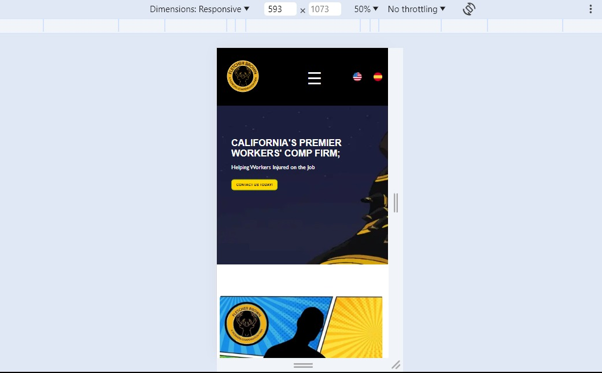
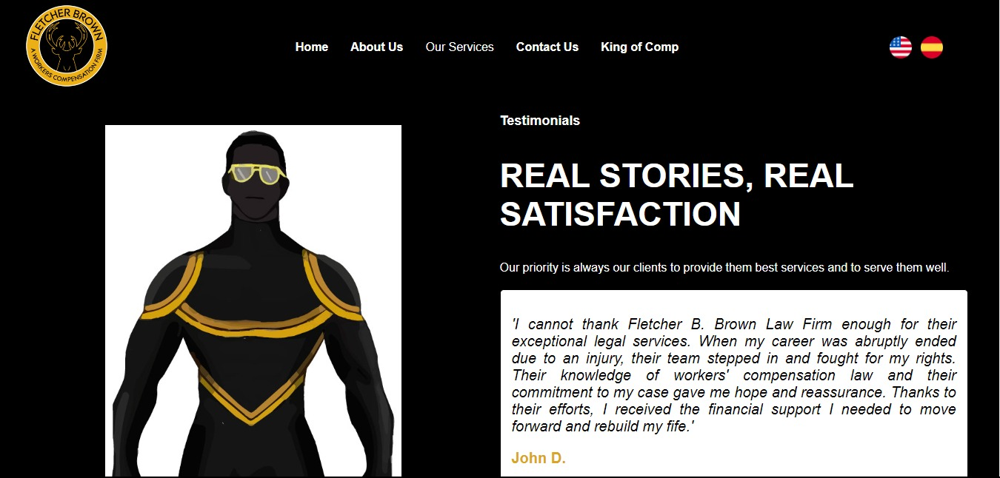

# Fletcher B. Brown Law Firm.

## Descripción
Desarrollo y despliegue de sitio web responsive para Fletcher B. Brown Law Firm.

## Enlace
[Fletcher B. Brown Law Firm.](https://fletcherbrownlaw.com/)

## Capturas
- INICIO

- SOBRE NOSOTROS

- COMIC BOOKS

- COMIC SLIDER

- CONTACTO

- AGRADECIMIENTO

- PREGUNTAS Y RESPUESTAS

- FOOTER

- MENU RESPONSIVE

- SERVICIOS GRID

- SERVICIO

- TESTIMONIOS

## Tecnologías Utilizadas
- JavaScript
- Html
- Css

## Autor
Sebastián García & King of Comp Medias SAS.
2024
---

¡Gracias por interesarte! Si tienes alguna pregunta o comentario, no dudes en ponerte en contacto.
